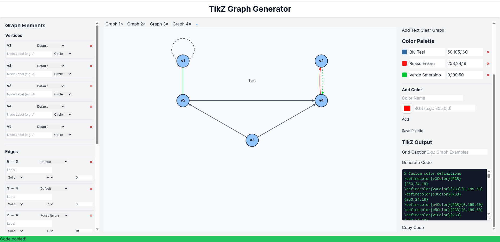
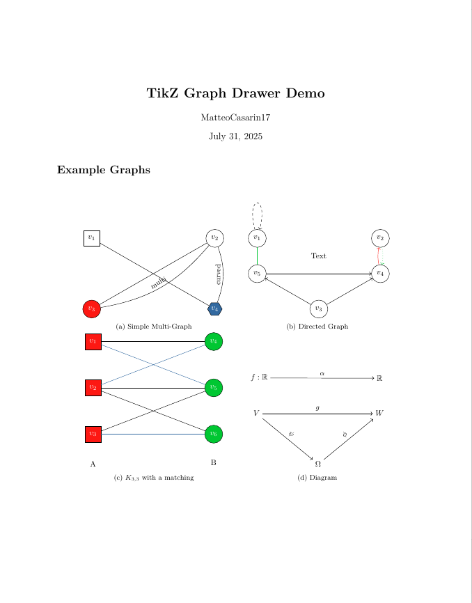

# TikZ Graph Generator

GitHub: <https://github.com/MatteoCasarin17/TikZGraphGenerator>



*Overall UI.*



*Example of the generated output code.*

A simple and intuitive web application for creating graphs and automatically generating the corresponding LaTeX/TikZ code. Perfect for students, researchers, and anyone who needs to visualize graphs in their documents.

-----

## ✨ Features

* **Visual Editor:** Create, move, and delete vertices, edges, and text nodes directly on a canvas.
* **Property Panels:** Easily modify the properties of each element (colors, labels, styles, shapes, bend, loop position, direction).
* **Multi-Graph Management:** Work on multiple graphs simultaneously using dedicated tabs.
* **TikZ Export:** Generate clean LaTeX code ready to be copied and pasted into your documents.
* **Custom Color Palette:** Create, save, and use your own color palette.
* **Save/Load Project:** Save the entire project (all graphs and the palette) to a `.json` file to resume your work later.
* **Snap Functionality:** Smart guides for perfectly aligning nodes and text.
* **Zoom & Pan:** Navigate the canvas easily with mouse wheel zoom and drag-to-pan.

-----

## 🚀 Installation & Usage

To run the application locally, follow these steps.

**Prerequisites:**

* [Python 3.x](https://www.python.org/downloads/) installed.
* [Git](https://git-scm.com/downloads) installed.

**1. Clone the Repository**
First, clone this repository to your local machine:

```bash
git clone https://github.com/MatteoCasarin17/TikZGraphGenerator.git
cd TikZGraphGenerator
```

**2. Create a Virtual Environment**
It's good practice to use a virtual environment to isolate project dependencies.

```bash
# For macOS/Linux
python3 -m venv venv
source venv/bin/activate

# For Windows
python -m venv venv
.\venv\Scripts\activate
```

**3. Install Dependencies**
Install the necessary libraries from the `requirements.txt` file.

```bash
pip install -r requirements.txt
```

**4. Install and use these LaTeX Packages**

```bash
\usepackage{tikz}                  
\usetikzlibrary{arrows.meta,shapes}
\usepackage{subcaption}
\usepackage{xcolor}
\usepackage{caption}
```

Make sure you are using the *lualatex* compiler in your LaTeX editor.

**5. Start the Application**

```bash
python app.py
```

The application will automatically open in your default web browser at `http://127.0.0.1:5000`.

-----

## 🛠️ Project Structure

```
├── static/
│   └── js/
│       └── main.js     # Frontend logic (canvas interaction, UI updates)
├── templates/
│   └── index.html      # HTML structure of the web page
├── app.py              # Flask backend (server, TikZ code generation, palette management)
├── requirements.txt    # Python dependencies
├── colors.csv          # Stores the custom color palette
├── .gitignore          # Files/directories to ignore in Git
├── LICENSE             # Project's open-source license
└── README.md           # This file
```

-----

## ⌨️ Controls & Shortcuts

* **Create Vertex:** Click on an empty canvas area.
* **Move Element:** Click and drag a vertex or text node.
* **Create Edge:** Hold \<kbd\>Shift\</kbd\> and drag from one connectable element (vertex/text) to another.
* **Create Loop:** Hold \<kbd\>Shift\</kbd\> and double-click on a vertex.
* **Add Text Node:** Click the "Add Text" button, then click on the canvas. A prompt will appear.
* **Edit Text Node:** Double-click on an existing text node.
* **Pan View:** Hold \<kbd\>Alt\</kbd\> and drag the canvas, or use the middle mouse button.
* **Zoom:** Use the mouse wheel to zoom in/out.
* **Edit Graph Name:** Double-click on a graph tab.
* **Snap Lines:** Automatic alignment guides appear when dragging elements near others.

-----

## 🤝 Contributing

Contributions are welcome\! If you have suggestions for improvements or find bugs, please open an issue or submit a pull request.

1. Fork the repository.
2. Create a new branch (`git checkout -b feature/your-feature-name`).
3. Make your changes.
4. Commit your changes (`git commit -m 'Add new feature'`).
5. Push to the branch (`git push origin feature/your-feature-name`).
6. Open a Pull Request.

-----

## 📜 License

This project is licensed under the MIT License. See the [LICENSE](https://mit-license.org/) file for details.

-----

## 📧 Contact

* Matteo Casarin / MatteoCasarin17
* <matteo.csr.17@gmail.com>

<!-- end list -->

```
```
